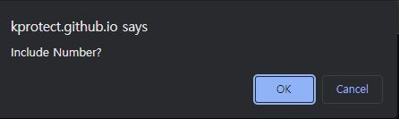

# Welcome to Final Production of PW-Gen-1.0 
## Live Production: https://kprotect.github.io/PW-Gen-1.0/

 

### This random passwrod generator gives you a very high security level generated password for users need.

 

### PW-Gen-1.0  will ask user/client prompted for passwrod criteria
 

### Alert message will popup if user/client didnt choose the right value!
 

### User/client must choose vaild numbers only. 
 

 
 
 

### Confirm message will popup if user/client wheather or not want to include lowercase,uppercase,numeric, and/or speical characters
 
 

 
 

 
 
 

-
 
 

 

 ## Final Generated Passwrod
 
